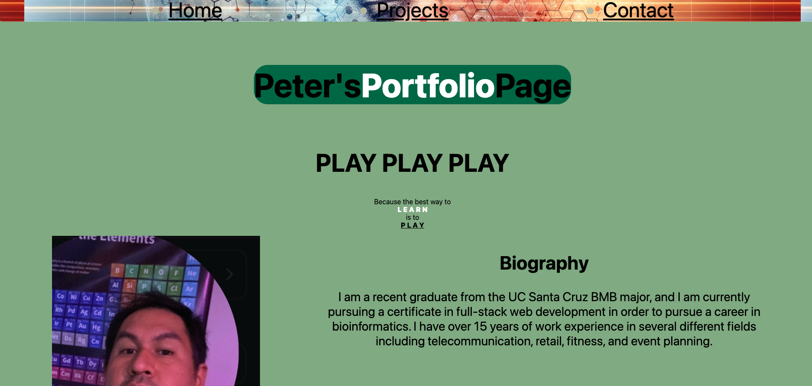
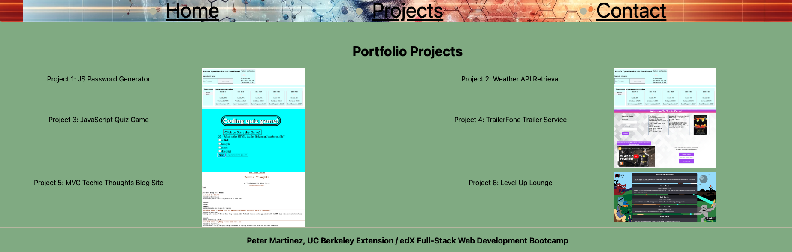
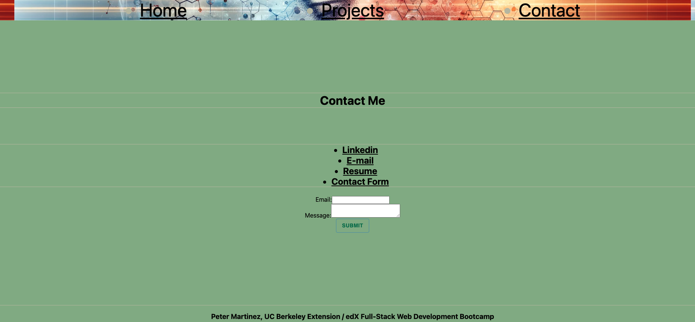

# Peter's React Portfolio

  
## Description
This is a web development work portfolio designed using a React framework with JavaScript. It features a biography of the developer, a page of completed projects, and a contact form for reaching out and seeing other resources related to the developer.

## Table of Contents

- [Installation](#installation)
- [Usage](#usage)
- [Screenshots](#screenshots)
- [License](#license)
- [Contributing](#contributing)
- [Questions](#questions)

  
## Installation
The site simply requires a web browser to access.

## Usage
Navigate the site using a web browser, and use the navigation links to move between parts of the page. The URL of the deployed application is,

https://peters-react-portfolio.netlify.app/

## Screenshots

## License
MIT

Copyright <2024> <PETER MARTINEZ>

Permission is hereby granted, free of charge, to any person obtaining a copy of this software and associated documentation files (the “Software”), to deal in the Software without restriction, including without limitation the rights to use, copy, modify, merge, publish, distribute, sublicense, and/or sell copies of the Software, and to permit persons to whom the Software is furnished to do so, subject to the following conditions:

The above copyright notice and this permission notice shall be included in all copies or substantial portions of the Software.

THE SOFTWARE IS PROVIDED “AS IS”, WITHOUT WARRANTY OF ANY KIND, EXPRESS OR IMPLIED, INCLUDING BUT NOT LIMITED TO THE WARRANTIES OF MERCHANTABILITY, FITNESS FOR A PARTICULAR PURPOSE AND NONINFRINGEMENT. IN NO EVENT SHALL THE AUTHORS OR COPYRIGHT HOLDERS BE LIABLE FOR ANY CLAIM, DAMAGES OR OTHER LIABILITY, WHETHER IN AN ACTION OF CONTRACT, TORT OR OTHERWISE, ARISING FROM, OUT OF OR IN CONNECTION WITH THE SOFTWARE OR THE USE OR OTHER DEALINGS IN THE SOFTWARE.

## Contributing
Please reach out to the developer at the links under Contact, or via GitHub.

## Questions
For questions about this project, please reach out to me on GitHub, https://github/reasonablep or via e-mail at, pmrtnz@me.com. Thanks for reading. 
